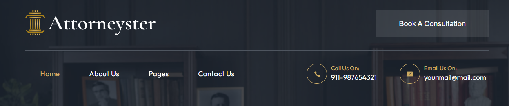
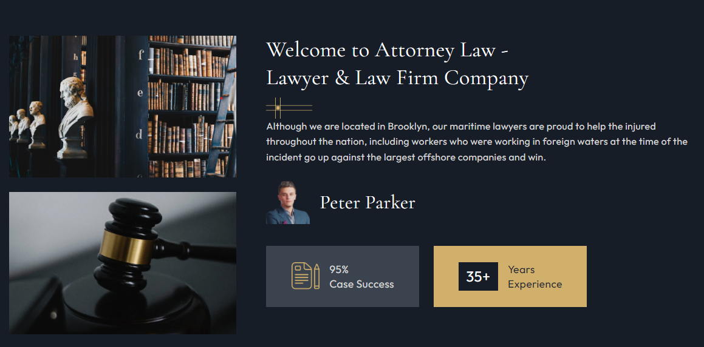
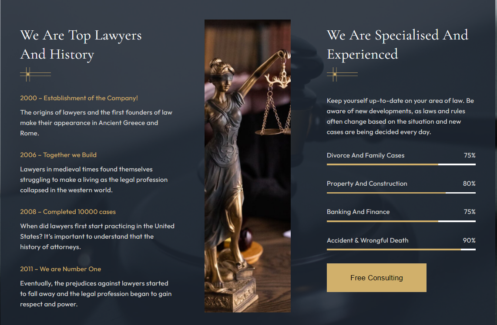
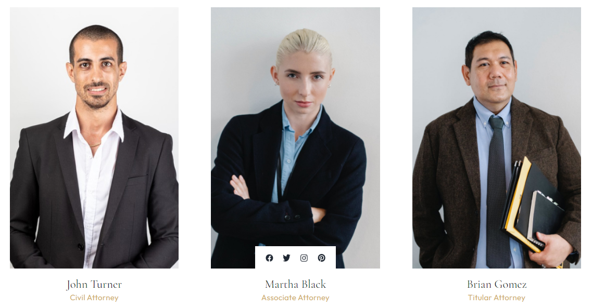
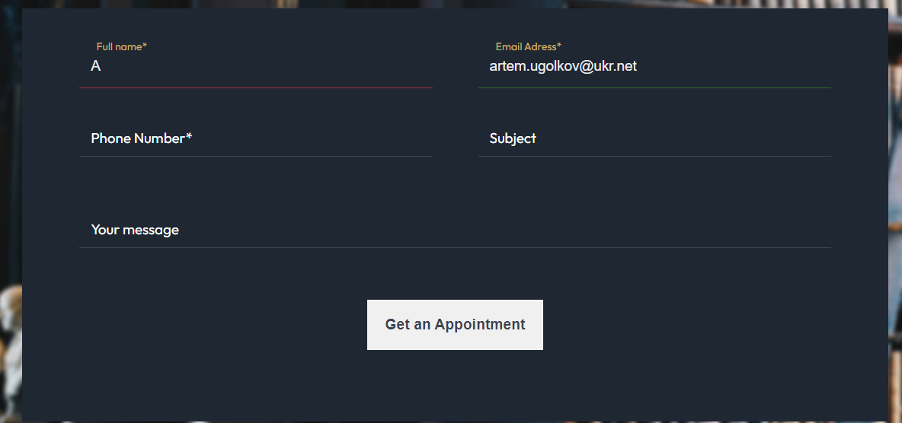
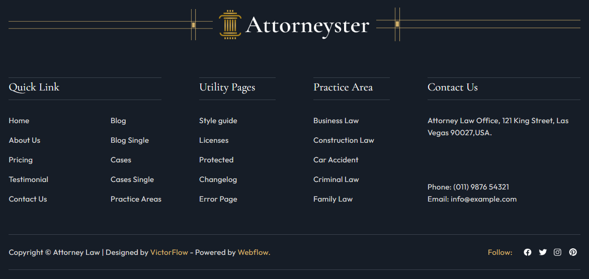

# Attorneyster-law-professionals (PET-project)

[Here you can check it](https://artemuholkov.github.io/Attorneyster-law-professionals/)

---

I had figma design for this project.
This landing page is 100% responsive for all types of screens.
I used HTML, CSS, JS, JQuery in this project.

---

### What was interesting in this project:

1. Responsive header



2. interesting structured sections created using flexbox





3. Attorney section. Link panel appears on hover.



4. Slider. I used SwiperSlider in this project.
   Connected using CDN.


```
 <script>
      var swiper = new Swiper('.mySwiper', {
        navigation: {
          nextEl: '.swiper-button-next',
          prevEl: '.swiper-button-prev',
        },
        loop: true,
        autoplay: {
          delay: 3000,
        },
      });
    </script>
```

4. Responsive form created with RegExp to make sure inputs filled correctly.



5. Footer



---
